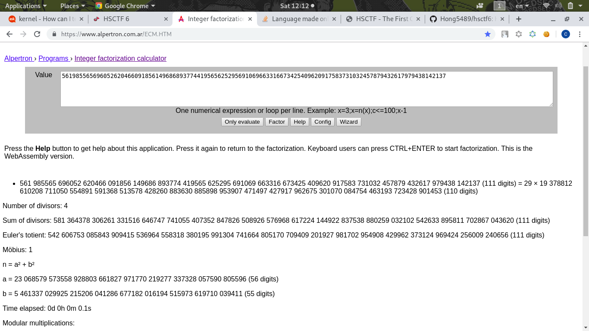

# Reverse Search Algorithm
Description
```
WWPHSN students, gotta get these points to boost your grade.

n = 561985565696052620466091856149686893774419565625295691069663316673425409620917583731032457879432617979438142137
e = 65537
c = 328055279212128616898203809983039708787490384650725890748576927208883055381430000756624369636820903704775835777
```
Typical weak RSA encryption because of `n` is too small

[Wikipedia about RSA](https://en.wikipedia.org/wiki/RSA_(cryptosystem))

I use this [nice website](https://www.alpertron.com.ar/ECM.HTM) to factor `p` and `q` for me (Because n = pq)



Ok, now we know:
```
p = 29 
q = 19 378812 610208 711050 554891 591368 513578 428260 883630 885898 953907 471497 427917 962675 301070 084754 463193 723428 901453
```

According to wikipedia, to calculate the decryption key `d`:
```
λ(n) = (p-1) * (q-1)
d = inverse of e mod λ(n) 
```
And calculate the plaintext:
```
m = c^(d) mod n
```
I used python to calculate all these:
```python
from Crypto.Util.number import inverse
n = 561985565696052620466091856149686893774419565625295691069663316673425409620917583731032457879432617979438142137
e = 65537
c = 328055279212128616898203809983039708787490384650725890748576927208883055381430000756624369636820903704775835777
p = 29 
q = 19378812610208711050554891591368513578428260883630885898953907471497427917962675301070084754463193723428901453
phi = (p-1)*(q-1)
d = inverse(e,phi)
m = pow(c,d,n)
print hex(m)[2:-1].decode('hex') # convert to string and print out
```

# Flag
> hsctf{y3s_rsa_1s_s0lved_10823704961253}