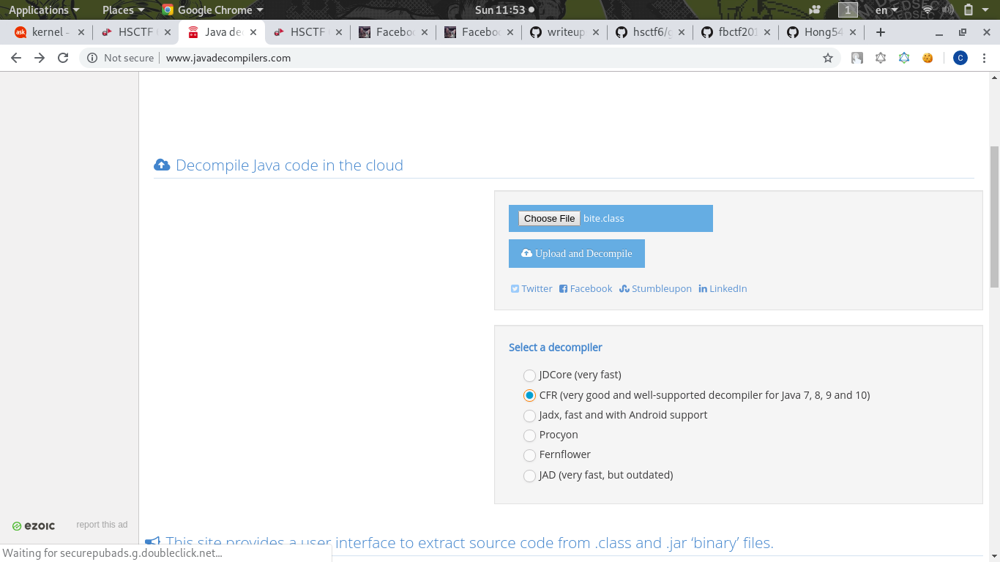
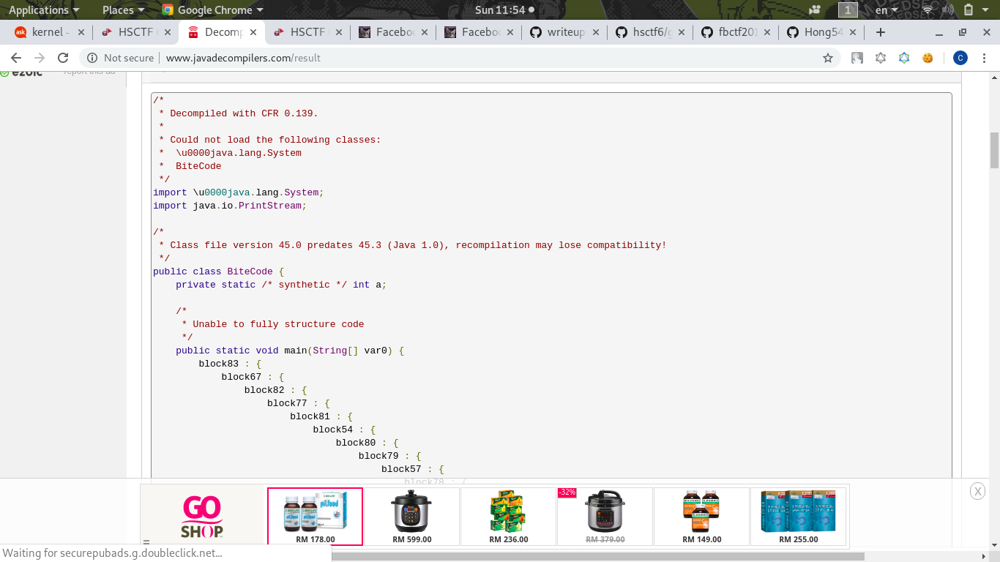

# Bitecode
Description
```
Written by: ItzSomebody

Keith went crazy and told me to work on the compiled form of Java instead of the source code. Unfortunately, all decompilers I've tried crash on attempting to decompile. Can you help out?
```
[bite.class](bite.class)

I tried to run this, but didn't work well:
```
# java bite
Error: LinkageError occurred while loading main class bite
	java.lang.ClassFormatError: Illegal class name "java/lang/System" in class file bite
```

I using this [website](http://www.javadecompilers.com/) to decompile it!

Using **CFX as Decompiler** because JDCore didn't work




Copied all into [bite.java](bite.java)

I investigate the code quite long because its messy

First, `var0` is our input also arguments:
```java
public static void main(String[] var0) {
	...
	...
```

These line is interesting:
```java
var3_3 = var0[0].toCharArray();
var4_4 = var3_3.length;
if ((var4_4 ^ 927739485 ^ 927739457) != 0) {
    (System)null;
    java.lang.System.out.println("Nah");
    return;
}
```

`var4_4` is our input length, these lines means if `our input line xor 927739485 xor 927739457 == 0` then it will not `return`

So our input length should be `927739485 XOR 927739457` which is 28:
```python
>>> 927739485 ^ 927739457
28
```
Next it declare `v0 = var3_3` and do XOR condition:
```java
v0 = var3_3;
if ((v0[0] ^ 189074585) - 189074673 != 0)
{
    do {
        if (var2_2 == 0) {
            (System)null;
            java.lang.System.out.println("Nah");
        }
        break;
    } while (true);
}
```
These lines basically means the first letter of our input must be `189074585 XOR 189074673` 

Calculate it with python:
```
>>> 189074585 ^  189074673
104
>>> chr(104) # ascii value
'h'
```
Yeah! Must be it, first character is `h`

Next few lines are almost the same comparison:
```java
if ((v0[1] ^ -227215135) - -227215214 != 0)
...
if ((v0[2] ^ 19240864) - 19240899 == 0)
...
if ((v0[3] ^ 245881291) - 245881279 == 0)
...
...
...
```
I wrote a [python script](solve.py) auto calculate all the condition and combine all characters:
```python
import re
text = open("bite.java").read()
text = re.findall("v0\[[0-9]+\] \^ [0-9-]+\) \- [0-9-]+",text)
v0 = [0 for i in range(28)]
for i,t in enumerate(text):
	exec("v0[%i] = chr(" % (i) + t.replace(") -",' ^') + ")")
print ''.join(v0)
```
## Flag
> hsctf{wH04_u_r_2_pr0_4_th1$}