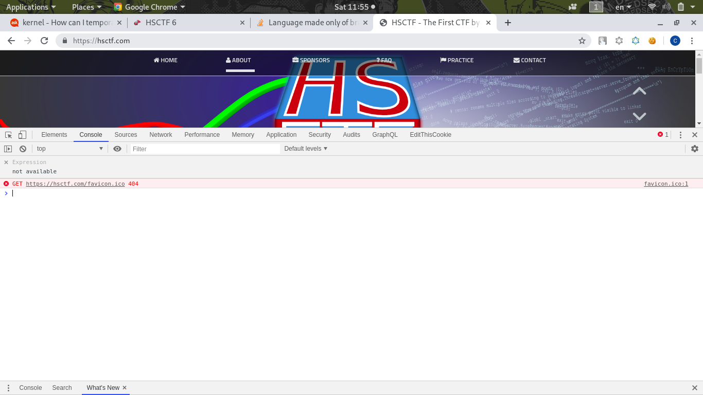
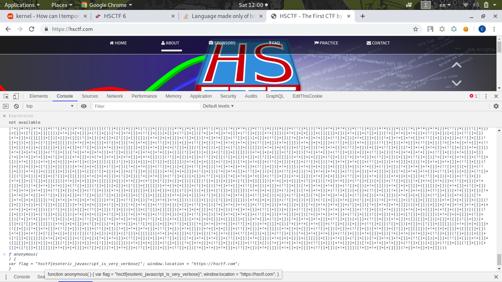

# Verbose

Description:
```
Written by: dwang

My friend sent me this file, but I don't understand what I can do with these 6 different characters...
```
[verbose.txt](verbose.txt)

Open it, its a very loong text contains square bracket plus signs and exclamation marks:
```
[][(![]+[])[+[]]+([![]]+[][[]])[+!+[]+[+[]]]......
```
Do a quick google search, I found a post in [StackOverflow](https://stackoverflow.com/questions/25622221/language-made-only-of-brackets-plus-and-exclamation-marks)

It seems its a **Javascript language** and it can be run at JavaScript Console

So I test it in my Google Chrome console:


But it just redirect me to the [CTF website](https://hsctf.com/)

After a while, I just remove the last two brackets `()` because the I guess those brackets means call the function

After I press Enter, it works!!


# Flag
> hsctf{esoteric_javascript_is_very_verbose}